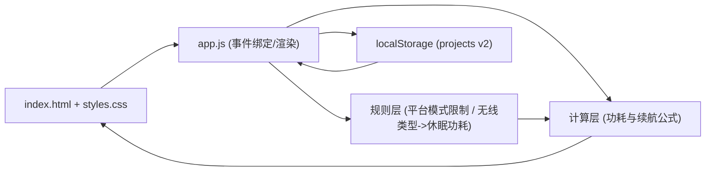
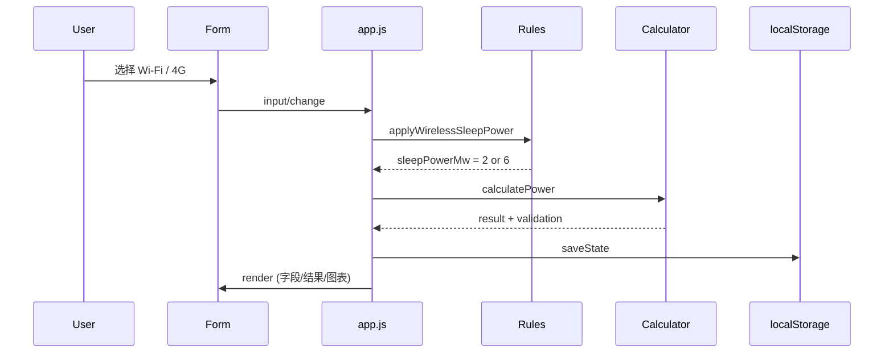
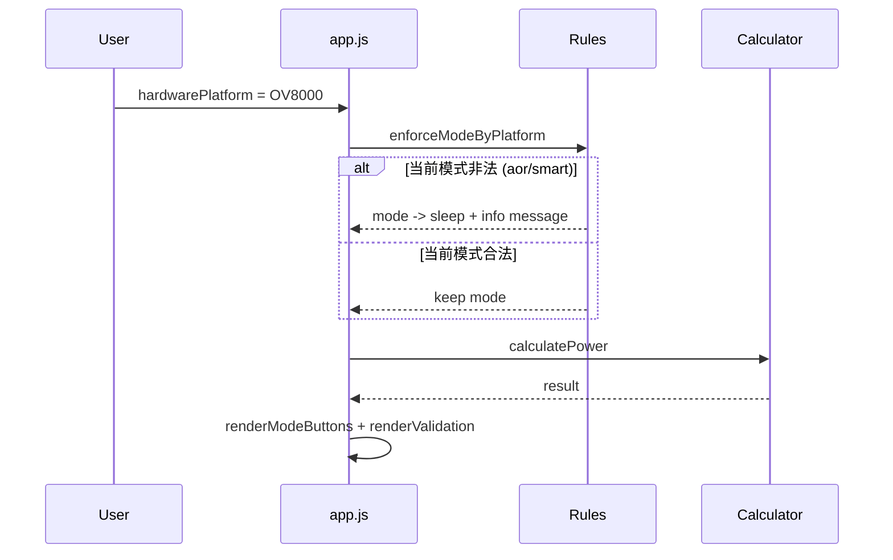

# Architecture - 电池摄像头功耗计算器（项目版 Web）

## 1. 架构概览

当前系统为纯前端静态应用，运行在浏览器中，不依赖后端服务。



## 2. 技术栈

- HTML（页面结构）
- CSS（自定义样式 + 响应式）
- Vanilla JavaScript（状态、计算、渲染）
- [Chart.js](https://www.chartjs.org/)（图表）

## 3. 文件职责

### `/Users/steed/Sync/Power-analy/index.html`

- 页面结构定义
- 表单字段、按钮、输出区、图表容器
- 引入 `styles.css` 与 `app.js`

### `/Users/steed/Sync/Power-analy/styles.css`

- 视觉风格（玻璃面板、仪表盘风格）
- 响应式布局（桌面双栏 / 移动单栏）
- 表单、按钮、禁用态、模式按钮禁用样式
- 打印样式

### `/Users/steed/Sync/Power-analy/app.js`

- 状态管理（`state.projects` / `state.selectedProjectId`）
- 项目 CRUD（新建、保存、另存为、删除）
- 输入归一化与业务规则约束
- 功耗计算逻辑
- UI 渲染（表单、模式、结果、图表、校验提示）
- 本地存储与旧数据迁移
- CSV 导出

## 4. 数据模型

## 4.1 Project

```js
{
  id: string,
  name: string,
  createdAt: string,
  updatedAt: string,
  input: PowerInput,
  result: PowerResult,
  validation: ValidationResult
}
```

## 4.2 PowerInput（关键字段）

```js
{
  mode: "sleep" | "aor" | "always" | "smart",
  wirelessType: "wifi" | "4g",
  hardwarePlatform: "6920" | "6921" | "6941" | "OV8000" | "other",
  batteryMah: number,
  voltageV: number,
  efficiencyPct: number,
  activePowerMw: number,
  wakeCountPerDay: number,
  wakeDurationSec: number,
  sleepPowerMw: number,       // 自动由 wirelessType 推导
  aorPowerMw: number,
  smartThresholdPct: number
}
```

## 4.3 PowerResult（关键字段）

```js
{
  totalEnergyWh: number,
  dailyEnergyMwh: number,
  avgPowerMw: number,
  runtimeDays: number,
  runtimeMonths: number,
  displayRuntimeValue: number,
  displayRuntimeUnit: "天" | "小时",
  activeHoursPerDay: number,
  idleHoursPerDay: number,
  breakdown: {
    activeMwh: number,
    sleepMwh: number,
    aorMwh: number
  }
}
```

## 5. 核心模块设计

## 5.1 状态层（State）

`state` 为单例对象，保存运行时状态：

- `projects`: 当前全部项目数组
- `selectedProjectId`: 当前选中项目
- `chart`: Chart.js 实例（复用更新）

特点：

- 所有 UI 变更最终落到当前 `project.input`
- 每次输入更新后执行重算并保存
- `render()` 负责从 state 回填 UI

## 5.2 规则层（Rule Enforcement）

### 函数

- `getAllowedModesByPlatform(platform)`
- `getSleepPowerByWirelessType(wirelessType)`
- `applyWirelessSleepPower(input)`
- `enforceModeByPlatform(input)`

### 规则职责

- 平台限制可选模式
- 无线类型绑定休眠功耗
- 平台切换导致非法模式时自动回退

规则层在计算前执行，保证计算层输入始终合法。

## 5.3 计算层（Calculator）

### 流程

1. `normalizeInput(raw)`
2. 应用无线类型规则（自动设定 `sleepPowerMw`）
3. 应用平台规则（限制模式）
4. `validateInput(input)`
5. `calculatePower(input)`

### 公式（概念）

- 电池总能量（Wh）由 `mAh * 电压 * 效率` 得到
- 每日活动时长由 `唤醒次数 * 单次录制时长` 得到
- 不同模式下计算每日能耗（mWh）
- 续航天数 = `总能量 / 日能耗`

说明：智能模式采用 AOR 与休眠待机能耗按阈值加权估算（沿用参考页思路）。

## 5.4 渲染层（Renderer）

主要渲染函数：

- `renderProjectSelector()`
- `renderForm()`
- `renderModeButtons()`
- `renderValidation()`
- `renderSummary()`
- `renderChart()`

设计原则：

- 渲染函数只读 state，不直接处理业务规则
- 业务规则在输入/计算阶段完成
- UI 与计算逻辑低耦合

## 5.5 存储层（Persistence）

### 当前版本

- Key: `power-analy-mvp-projects-v2`
- 结构：

```js
{
  selectedProjectId: string,
  projects: Array<{
    id, name, createdAt, updatedAt, input
  }>
}
```

### 兼容迁移

- 若 `v2` 不存在，尝试读取旧 `power-analy-mvp-scenarios-v1`
- 将 `scenario` 转为 `project`
- 依据旧 `sleepPowerMw` 粗略推断 `wirelessType`
- 默认 `hardwarePlatform = "6920"`

## 6. 事件流（典型交互）

### 6.1 修改无线类型



### 6.2 修改平台为 OV8000



## 7. 边界条件与失败模式

- 活动时长 > 24h/day：校验错误，结果置为默认值
- 输入为空/非法数字：使用默认值或触发校验
- 图表库加载失败：显示 fallback 提示，不影响计算与导出
- 删除最后一个项目：自动创建默认项目

## 8. 可扩展方向

- 抽离计算引擎为独立模块（便于迁移到 React / App）
- 增加项目模板系统（平台+无线+默认功耗）
- 增加 PNG 导出
- 增加高级参数（温度、衰减、自放电）
- 引入测试（单元测试覆盖规则层与计算层）
